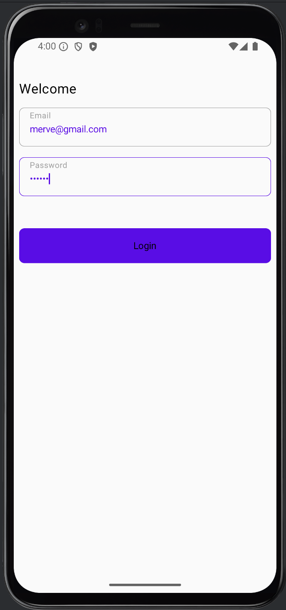
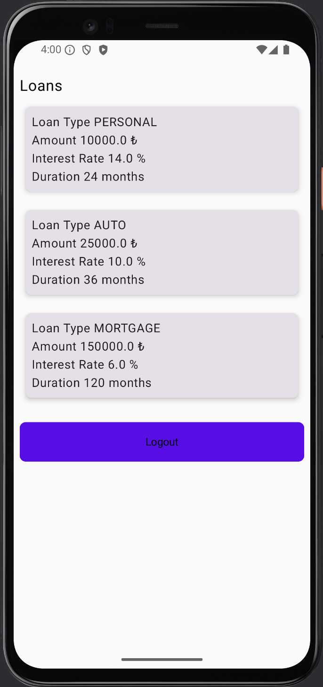

# Fintech Loan Management App

A modular, scalable **Loan Management Application** built with **Jetpack Compose**, **Hilt**, **Strategy Pattern**, and **Clean Architecture** principles.  
This application simulates login and loan calculation functionalities, with strategy-driven interest rate and term calculation for various loan types.

---

## ✨ Features

- 🔐 Login screen with local validation and session persistence
- 💼 Loan listing with strategy-based calculation:
    - Personal Loan
    - Auto Loan
    - Mortgage Loan
- ♻️ Strategy Pattern for dynamic interest and term calculation
- 🧪 Unit tested ViewModels and UseCases
- 🧱 Modularized Clean Architecture

---

## 📁 Project Structure

```
app/
component/
core/
    ├── common/
    ├── navigation/
    ├── theme/
    ├── strings/
feature/
    ├── login/
    │   ├── data/
    │   ├── domain/
    │   └── presentation/
    └── loan/
        ├── data/
        ├── domain/
        └── presentation/
```

---

## 🧠 Design Patterns & Architecture

### Clean Architecture
- **Presentation Layer:** ViewModels, UI state, navigation
- **Domain Layer:** UseCases, interfaces
- **Data Layer:** Dummy repositories simulating backend

### Strategy Pattern
Each loan type uses its own calculation strategy:

```kotlin
interface LoanCalculationStrategy {
    fun calculateInterestRate(amount: Double): Double
    fun calculateDurationMonths(amount: Double): Int
}
```

```kotlin
class PersonalLoanStrategy : LoanCalculationStrategy
class AutoLoanStrategy : LoanCalculationStrategy
class MortgageLoanStrategy : LoanCalculationStrategy
```

These strategies are injected via `LoanCalculationManager`.

---

## 🧩 Reusable Components

- **LoanTextField** – Custom text field with validation support
- **LoanButton** – Themed button with styling and shape
- **LoanText** – Typography-styled text component
- **LoanCard** – Reusable card container with shape and elevation
- **LoanItem** – Loan detail presentation in a styled card

---

## 🧪 Testing

All ViewModels and UseCases are covered with unit tests using:

- `kotlinx-coroutines-test`
- `mockk`
- `turbine`

Example tested use cases:
- `GetLoansUseCase` with mock strategies and repository
- ViewModel input and UI state validation logic

---

## 🔧 Tech Stack

| Layer            | Tools & Libraries                             |
|------------------|-----------------------------------------------|
| UI               | Jetpack Compose                               |
| DI               | Hilt (Dagger)                                 |
| Navigation       | Compose Navigation                            |
| Testing          | MockK, Turbine, JUnit5, Coroutines Test       |
| Architecture     | Clean Architecture, Strategy Pattern          |
| Language         | Kotlin (Parcelize, Sealed Classes, Flows)     |

---

## 📷 Screenshots

| Login Screen                        | Loans Screen                        |
|------------------------------------|-------------------------------------|
|          |           |

---

## 📄 License

This project is open-sourced for demonstration and educational purposes.
